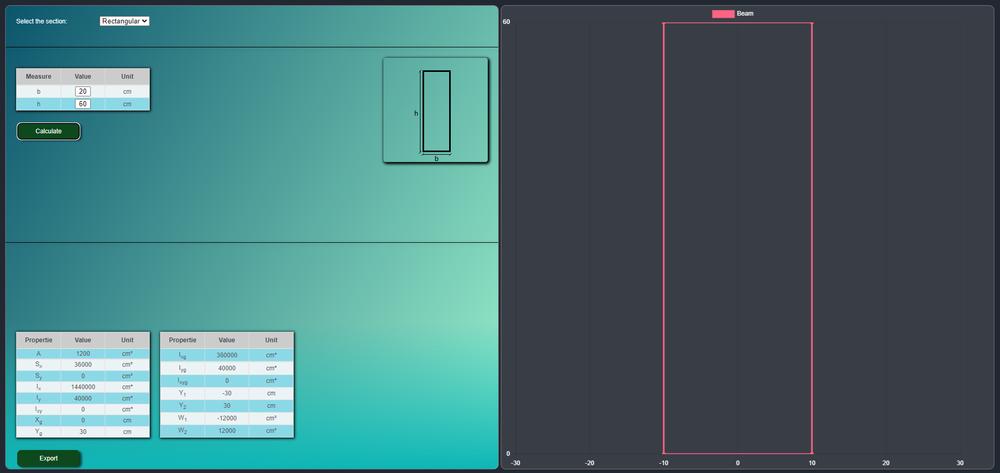
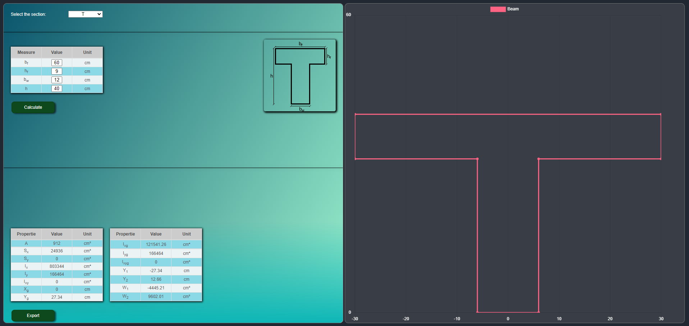
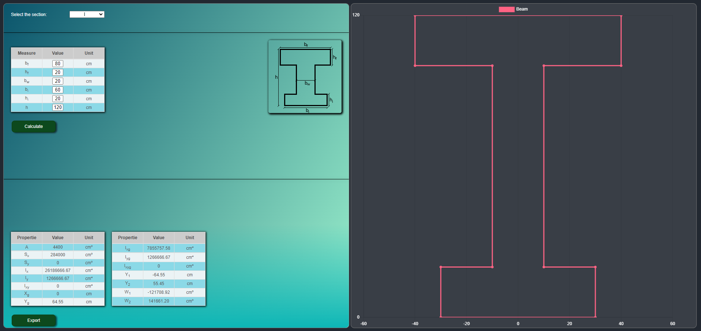
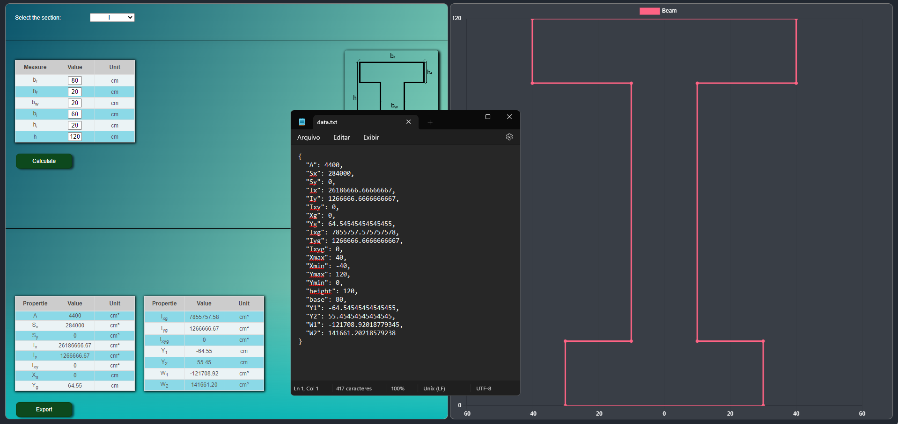

<h1>UI - Beam Geometric Properties (en)</h1>

This project aims to demonstrate a user interface using the <i>geometric-props</i> library available at: <a href='https://github.com/Brunoengi/geometric-props-ts'>click here.</a> In this project, some figures that are commonly used as sections of reinforced concrete beams will be presented, such as rectangular section, T section and I section. In the application, a graphical library called <i>chart.js<i> is integrated to visualize the constructed section. Finally, it is possible to view and export the values ​​of geometric properties in txt format.

<h2>Project Images</h2>

  
  

  
  

<h2>How to execute te application</h2>

The application was built to 'run' on the client side, in the main folder, it is necessary to run the index.html file using the browser of your choice, by doing this single step you will already see the interface. A curious title, the node_modules folder was added to the project just so that the user does not need to install the node project's dependencies, nor does it need to configure the paths.

<h1>UI - Propriedade Geométrica de Vigas (pt-br)</h1>

Este projeto tem como objetivo demonstrar uma interface do usuário em que é utilizado a biblioteca <i>geometric-props</i> disponível em: <a href='https://github.com/Brunoengi/geometric-props-ts'>clique aqui.</a> Nesse projeto, serão apresentadas algumas figuras que são comumente utilizadas como seção de vigas de concreto armado, como seção retangular, seção T e seção I. Na aplicação, é integralizada uma biblioteca gráfica chamada <i>chart.js<i> para visualização da seção construida. Por fim, é possível visualizar e exportar em formato txt os valores das propriedades geométricas.

<h2>Imagens do projeto:<h2>

  
  

  
  

<h2>Como executar a aplicação</h2>

A aplicação foi construída para 'rodar' no lado no cliente, na pasta principal, é necessário executar o arquivo index.html utilizando o navegador da sua preferência, fazendo esse único passo você já irá visualizar a interface. A título de curiosidade, a pasta node_modules foi acrescida ao projeto apenas para que o usuário não precise instalar as dependências do projeto node, nem precise fazer a configuração dos caminhos (paths). 
